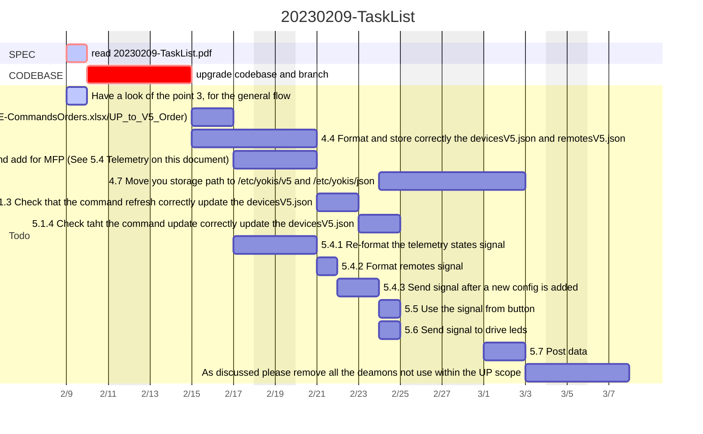
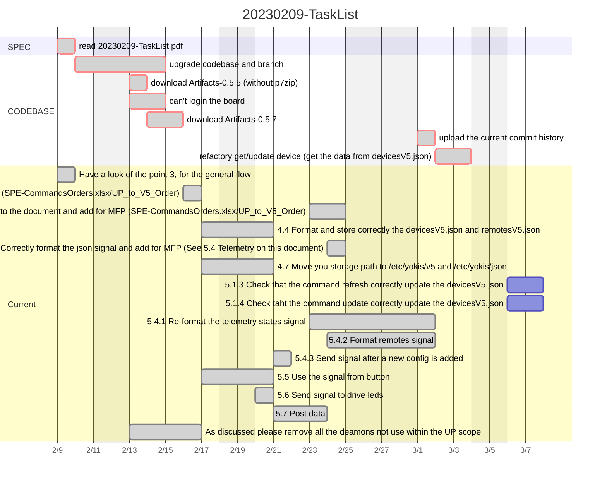

# 1. Todo 20230209

| ACTIVITY                                                     | STARTING DATE | EXPECTED FINISH DATE | EXPECTED EFFORT (days) | REAL FINISH DATE | NOTE |
| ------------------------------------------------------------ | ------------- | -------------------- | ---------------------- | ---- | ---- |
| Have a look of the point 3, for the general flow             | 2023-02-09 | 2023-02-09 | 1 | 2023-02-09 |      |
| 4.3: Change the order using to the document and add for MFP  | 2023-02-15 | 2023-02-16 | 2 | 2023-02-24       |  |
| 4.4: Format and store correctly the devicesV5.json and remotesV5.json | 2023-02-15 | 2023-02-20 | 4 | 2023-02-20 |  |
| 4.5 Correctly format the json signal and add for MFP | 2023-02-17 | 2023-02-20 | 2 | 2023-02-24 | See 5.4 Telemetry on this document |
| 4.7 Move you storage path to /etc/yokis/v5 and /etc/yokis/json | 2023-02-24 | 2023-03-02 | 3 | 2023-02-20 |      |
| 5.1.3 Check that the command refresh correctly update the devicesV5.json | 2023-02-21 | 2023-02-22 | 2 |      | In progress ... |
| 5.1.4 Check taht the command update correctly update the devicesV5.json | 2023-02-23 | 2023-02-24 | 2 |      | In progress ... |
| 5.4.1 Re-format the telemetry states signal | 2023-02-17 | 2023-02-20 | 2 | 2023-03-01 |      |
| 5.4.2 Format remotes signal | 2023-02-21 | 2023-02-21 | 1 | 2023-03-01 |      |
| 5.4.3 Send signal after a new config is added | 2023-02-22 | 2023-02-23 | 2 | 2023-02-22 |      |
| 5.5 Use the signal from button | 2023-02-24 | 2023-02-24 | 1 | 2023-02-20 |      |
| 5.6 Send signal to drive leds | 2023-02-24 | 2023-02-24 | 1 | 2023-02-20 |      |
| 5.7 Post data | 2023-03-01 | 2023-03-02 | 2 | 2023-02-23 | without “uid” returned by the getinfo, only "serialId" |
| As discussed please remove all the deamons not use within the UP scope | 2023-03-03 | 2023-03-07 | 3 | 2023-02-17 |      |
|               |                      |                        |          |      |      |

# 2. Gantt

## 2.1. Analysis

## 2.2. Implement

